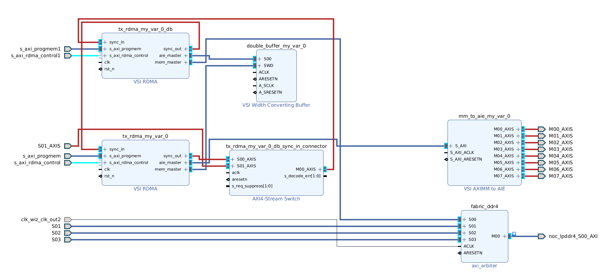
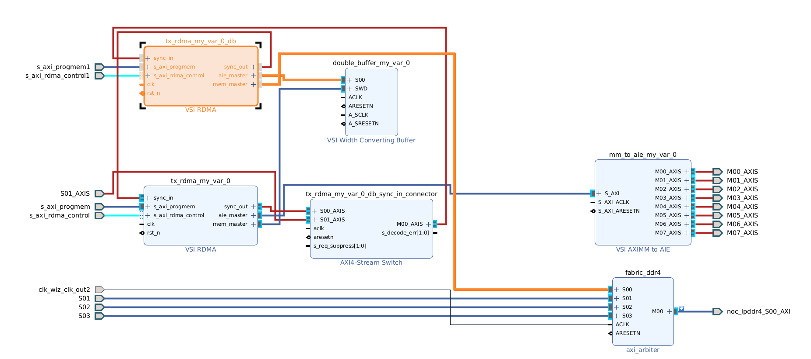
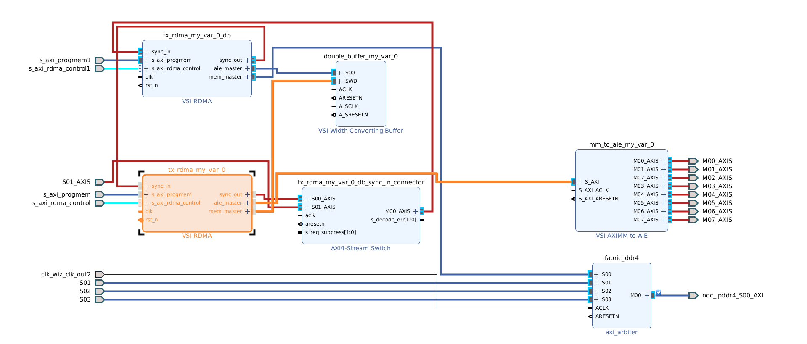
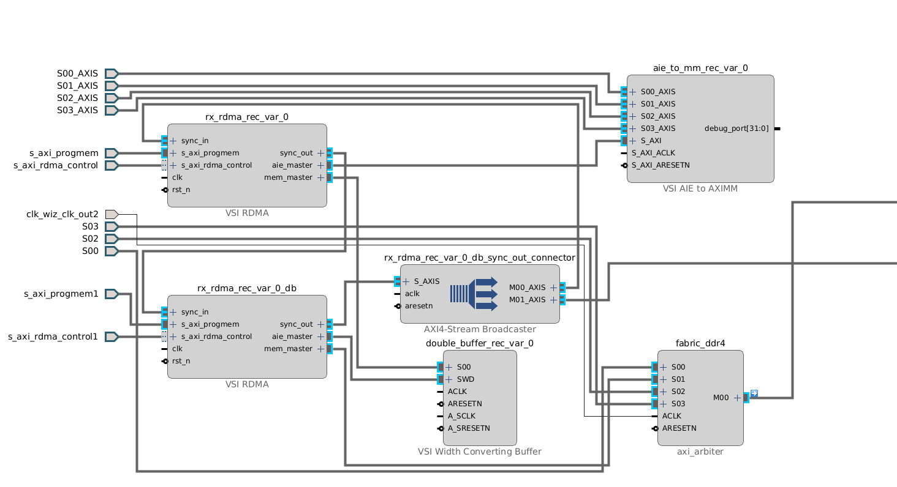
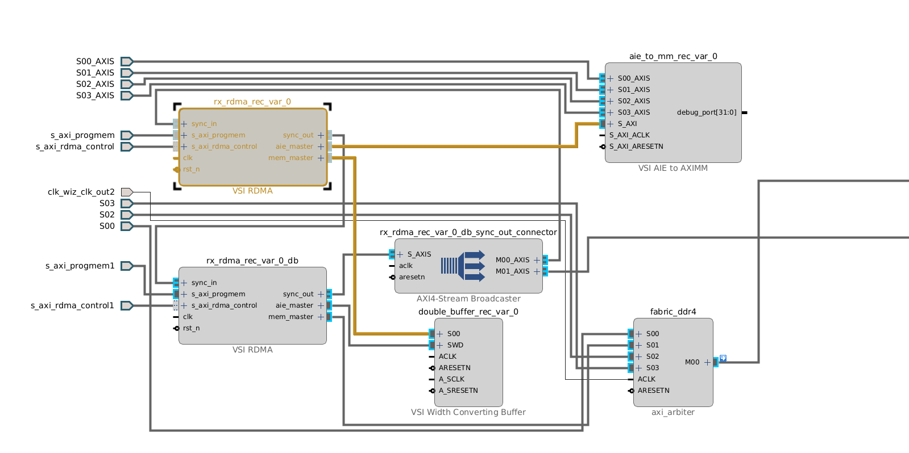
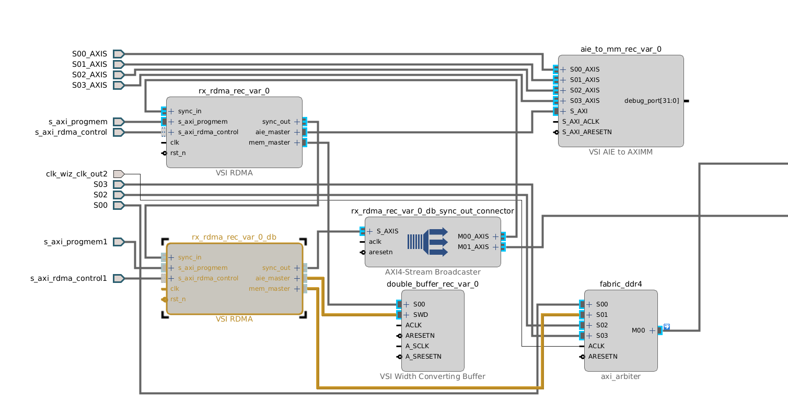

# Double Buffer in Python System Generator

Double Buffers can easily and automatically inserted into projects that arrays to describe data movemenent. 

## Double Buffer Arrays

ArrayDefs declaration is the same as before:

```python
my2dArray = vsg.ArrayDef(name = "myArray",
        dimensions = [128, 1024], 
        element_size = 4)
```
When adding the array to the application specify double buffer as following:

```python
myArr = myApp.add_array(myArray, fabric_ddr4, 16384, double_buffer = True)
```

Since a single array def can be added multiple to an appliction, each time an arraydef is added to the project the user has the option to enable the double buffer. If the double_buffer argument is not given it will by default be disabled. 

# Double Buffer Implementation

## TX Double Buffer

When using double buffer to send data to enpoints the created system will look like the following:




Two RDMAs are created, one will read from the DDR and place it into a double buffer, while the other will read from that double buffer and send the data to the endpoints. Sync ports are connected up to provide feedback between the two RDMAs informing each other when they are ready to read/write data.



The "double buffer" tx rdma reads from the DDR and places the data into the double buffer.



The regular tx rdma reads from the double buffer and write the the mm to aie block to send data to the endpoints.

## RX Double Buffer

When using double buffer to recieve data to enpoints the created system will look like the following:



Two RDMAs are created, one will read data from the endpoint and place it into a double buffer, while the other will read from that double buffer and put it data in the memory. Sync ports are connected up to provide feedback between the two RDMAs informing each other when they are ready to read/write data.



The regular tx rdma gathers data from the endpoints by reading from the aie to mm block and writes the gathered data to the double buffer.



The "double buffer" rx rdma reads from the double buffer and places the data into the memory.


Example: 
- [Automated Data Movement](double_buff/yaml/constraintsrdma_array.py)
